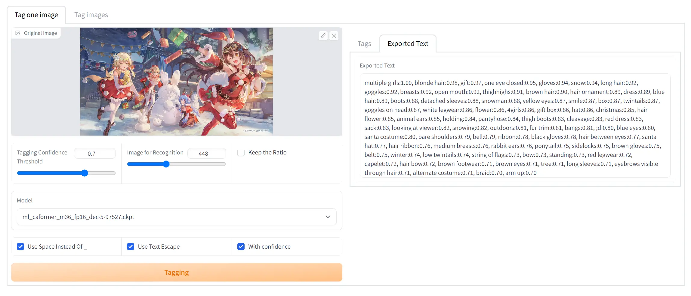

# ML-Danbooru: Anime image tags detector (webui extension)

## Introduction
An anime image taggger trained with cleaned [danbooru2021](https://gwern.net/danbooru2021).

[ML-Danbooru](https://github.com/7eu7d7/ML-Danbooru) uses the structure of multi-scale recognition, which has better detail recognition ability and more accurate than wd14.

## Model-Zoo
https://huggingface.co/7eu7d7/ML-Danbooru